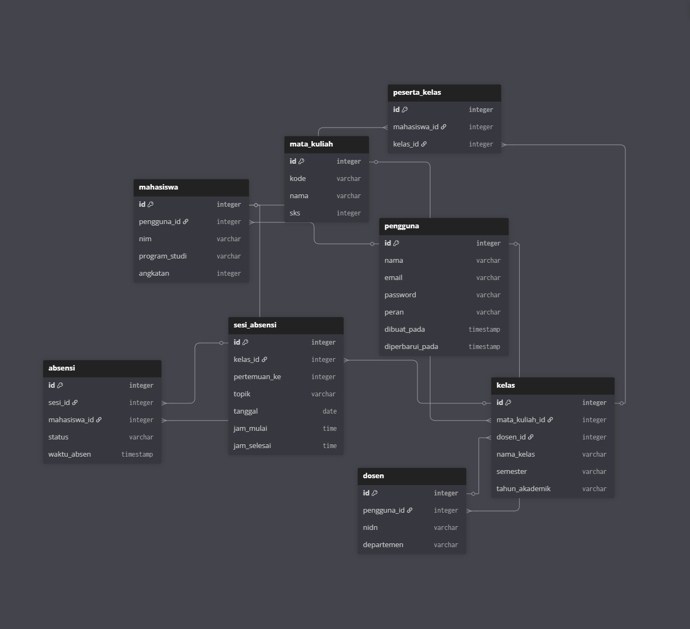

# 📋 Web Absensi IBBI

Sistem manajemen absensi mahasiswa berbasis web untuk **Institut Bisnis dan Informatika Indonesia (IBBI)**. Dibangun dengan **Express.js**, **Handlebars**, **SQLite**, dan **Bootstrap 5** — ringan, mudah diinstal, dan siap pakai dalam hitungan menit.

<p align="center">
  
</p>

<p align="center">
  
  
  
  
  
</p>

---

## 📦 Fitur

### ✅ Tersedia

| Fitur | Status |
|-------|--------|
| **Autentikasi & Session** — Login, logout, lupa/reset password via email | ✅ |
| **Role-Based Access** — Tiga role: admin, dosen, mahasiswa | ✅ |
| **Manajemen Admin** — CRUD pengguna admin | ✅ |
| **Manajemen Dosen** — CRUD dosen dengan NIDN & departemen | ✅ |
| **Manajemen Mahasiswa** — CRUD mahasiswa dengan NIM, prodi, angkatan | ✅ |
| **Manajemen Mata Kuliah** — CRUD mata kuliah dengan kode & SKS | ✅ |
| **Manajemen Kelas** — CRUD kelas per mata kuliah & dosen pengampu | ✅ |
| **Peserta Kelas** — Pendaftaran mahasiswa ke dalam kelas | ✅ |
| **Email Notifikasi** — Email kredensial akun & reset password | ✅ |
| **Validasi Input** — Validasi lengkap di setiap form | ✅ |
| **Keamanan** — bcrypt + prepared statements + session | ✅ |

### 🚧 Dalam Pengembangan

| Fitur | Status |
|-------|--------|
| **Sesi Absensi** — Pembuatan sesi absensi per pertemuan | ⏳ |
| **Pencatatan Absensi** — Hadir, izin, sakit, alpha | ⏳ |
| **Laporan & Rekap** — Rekap absensi per kelas/semester | ⏳ |

---

## 🚀 Quick Start

```bash
# 1. Clone & masuk direktori
cd web-absensi

# 2. Install dependencies
npm install

# 3. Inisialisasi database SQLite
npm run db:init

# 4. Jalankan development server (port 3000)
npm run dev
```

Buka [http://localhost:3000](http://localhost:3000) di browser.

### Konfigurasi Email (Opsional)

Salin `.env.example` ke `.env` dan isi kredensial email:

```env
EMAIL_HOST=smtp.gmail.com
EMAIL_PORT=587
EMAIL_USER=email@example.com
EMAIL_PASSWORD=your-app-password
APP_URL=http://localhost:3000
```

Email digunakan untuk mengirim kredensial akun baru & reset password.

---

## 🏗️ Arsitektur

### Stack

| Layer | Teknologi |
|-------|-----------|
| **Backend** | [Express.js](https://expressjs.com/) 5.x |
| **Template Engine** | [Handlebars](https://handlebarsjs.com/) (express-handlebars) |
| **Database** | [SQLite](https://www.sqlite.org/) (better-sqlite3) |
| **CSS** | [Bootstrap](https://getbootstrap.com/) 5.3 |
| **Auth** | bcrypt + express-session |

### Struktur MVC

```
web-absensi/
├── config/                  # Konfigurasi (email, dll)
├── controllers/             # Validasi, business logic, render view
├── database/                # Koneksi SQLite & schema init
├── middlewares/             # Auth middleware (isAuthenticated)
├── models/                  # Query database (better-sqlite3)
├── routes/                  # Routing HTTP → controller
├── views/                   # Template Handlebars (.hbs)
│   ├── layouts/             # Layout utama (main.hbs)
│   └── pages/               # Halaman per modul
├── index.js                 # Entry point aplikasi
└── package.json
```

### Alur Request

```
Browser → Routes → Controller → Model → SQLite
                      ↓
               Handlebars View → Browser
```

---

## 🗄️ Database Schema

7 tabel utama dengan foreign key relationships:

```
pengguna (user dengan role: admin | dosen | mahasiswa)
  ├── mahasiswa    — NIM, program studi, angkatan
  ├── dosen        — NIDN, departemen (fish | fast)
  ├── mata_kuliah  — kode, nama, SKS
  ├── kelas        — mata_kuliah_id, dosen_id, semester, tahun_akademik
  ├── peserta_kelas — many-to-many: mahasiswa ↔ kelas
  ├── sesi_absensi — pertemuan per kelas (belum aktif)
  └── absensi      — status hadir/izin/sakit/alpha (belum aktif)
```

Lihat [diagram.dbml](diagram.dbml) untuk detail lengkap.

---

## ⚙️ Scripts

| Script | Perintah | Fungsi |
|--------|----------|--------|
| **dev** | `npm run dev` | Jalankan server dengan auto-reload (nodemon) |
| **db:init** | `npm run db:init` | Reset & inisialisasi ulang database ⚠️ hapus data! |
| **db:seed** | `npm run db:seed` | Isi database dengan data dummy |

---

## 📖 Navigasi

| Route | Halaman | Auth |
|-------|---------|------|
| `/auth/login` | Login | ❌ |
| `/auth/forgot-password` | Lupa password | ❌ |
| `/` | Dashboard home | ✅ |
| `/mahasiswa/list` | Manajemen mahasiswa | ✅ |
| `/dosen/list` | Manajemen dosen | ✅ |
| `/mata-kuliah/list` | Manajemen mata kuliah | ✅ |
| `/kelas/list` | Manajemen kelas | ✅ |
| `/admin/list` | Manajemen admin | ✅ |

### Default Password

| Role | Default Password |
|------|-----------------|
| **Mahasiswa** | NIM (langsung di-hash bcrypt) |
| **Dosen** | NIDN (langsung di-hash bcrypt) |
| **Admin** | Diinput manual saat pembuatan |

---

## 📝 Konvensi Kode

### Bahasa: Indonesia

Seluruh kode — variabel, fungsi, komentar, UI — menggunakan **bahasa Indonesia**.

| Prefix | Makna | Contoh |
|--------|-------|--------|
| `ambil*` | Fetch / get | `ambilSemuaMahasiswa()` |
| `buat*` | Create | `buatMahasiswa()` |
| `update*` | Update | `updateMahasiswa()` |
| `hapus*` | Delete | `hapusMahasiswa()` |
| `kirim*` | Send | `kirimEmailDataUser()` |
| `pesan*` | Message | `pesanError`, `pesanSukses` |

### Naming Conventions

| Scope | Style | Contoh |
|-------|-------|--------|
| **JavaScript** | camelCase | `penggunaId`, `showCreateForm` |
| **Database** | snake_case | `pengguna_id`, `mata_kuliah` |
| **Routes** | kebab-case | `/mata-kuliah/create` |

---

## 🔒 Security

- **Session Auth** — Cookie session dengan masa berlaku 1 jam
- **Password Hashing** — bcrypt (salt rounds = 10)
- **SQL Injection** — Prepared statements di semua query
- **Input Validation** — Validasi ketat di controller sebelum operasi DB
- **Foreign Keys** — ON DELETE CASCADE untuk integritas data
- **Role Middleware** — Setiap route dilindungi middleware autentikasi

---

## 🧩 Cara Menambah Modul Baru

```bash
# 1. Buat model
touch models/[Nama].js

# 2. Buat controller
touch controllers/[Nama]Controller.js

# 3. Buat routes
touch routes/[nama]Routes.js

# 4. Buat view files
mkdir -p views/pages/[nama]
touch views/pages/[nama]/create.hbs
touch views/pages/[nama]/list.hbs
touch views/pages/[nama]/edit.hbs

# 5. Register di index.js
```

Pattern route:

```javascript
router.get("/create", Controller.showCreateForm);
router.post("/create", Controller.createEntity);
router.get("/list", Controller.listEntity);
router.get("/edit/:id", Controller.showEditForm);
router.post("/edit/:id", Controller.editEntity);
router.post("/delete/:id", Controller.deleteEntity);
```

---

## 🤝 Kontribusi

1. Fork repository
2. Buat branch fitur: `git checkout -b fitur/fitur-keren`
3. Commit perubahan: `git commit -m "feat: tambah fitur keren"`
4. Push: `git push origin fitur/fitur-keren`
5. Buat Pull Request

---

## 📄 Lisensi

ISC — Institut Bisnis dan Informatika Indonesia (IBBI)

---

<p align="center">
  Dibuat dengan ❤️ untuk civitas akademika IBBI
</p>
